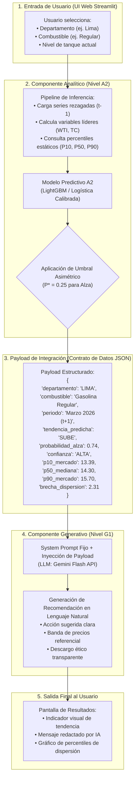

# Plantilla 3 — AI Product Canvas & Operaciones (Fase O)
**Curso:** AD5018 — Inteligencia Artificial para Negocios  
**Universidad:** Universidad de Ingeniería y Tecnología (UTEC)  
**Departamento:** Administración & Negocios Digitales · Malla 2024 — Ciclo 9  
**Proyecto:** TanqueLleno AI  
**Integrantes:** `[COMPLETAR: Nombre Completo 1, Nombre Completo 2, Nombre Completo 3, Nombre Completo 4]`  
**Fecha de entrega:** Semana 6  

---

## 1. AI Product Canvas

### 1.1 Problema (Copia textual exacta de Plantilla 1)
Los conductores particulares en Lima Metropolitana enfrentan una **elevada e invisible dispersión de precios minoristas entre estaciones de servicio en un mismo período, sumada a la incertidumbre sobre la dirección y el momento de traslado de los ajustes mensuales de precios mayoristas al surtidor**. Esta situación les impide anticipar si les conviene cargar tanque lleno hoy o esperar, así como identificar si la estación donde repostan se ubica en el rango razonable o en la cola cara del mercado.

### 1.2 Usuario Objetivo
Conductor particular de Lima Metropolitana que utiliza su vehículo propio a gasolina a diario (25 a 40 km/día), abastece 8 galones semanales de Gasolina Regular (G90) o Premium de su propio presupuesto y busca optimizar el momento y precio de compra.

### 1.3 Propuesta de Valor
TanqueLleno AI es un asistente inteligente que combina un modelo predictivo de tendencia mensual de precios con un encuadre estadístico de dispersión, entregando en lenguaje claro y accesible recomendaciones sobre el mejor momento para tanquear y la banda de precio justa para su combustible.

### 1.4 Fuentes de Datos (Consistente con Plantilla 2)
1. **Histórico mensual departamental Osinergmin:** 80 meses continuos (ene 2020 – ago 2026) para 24 departamentos (Archivos B y C).
2. **Registro de dispersión por grifo:** Muestra transversal de 8,825 estaciones de servicio al cierre de febrero de 2026 (Archivo A).
3. **Variables macroeconómicas rezagadas ($t-1$):** WTI, Brent, tipo de cambio BCRP y margen de refinación Costa del Golfo (Plan de ingestión Semana 7).

### 1.5 Arquitectura de Solución
- **Componente Analítico (Nivel A2 - Eje de Ambición):** Modelo de clasificación supervisada (LightGBM vs. Logística Regularizada vs. Baseline de persistencia) con optimización de umbrales bajo costo asimétrico.
- **Componente Generativo (Nivel G1 - Piso de Complejidad):** LLM (Gemini Flash) con prompt estructurado y contexto cerrado para traducción empática.
- **Patrón de Conexión:** Patrón 1 (Modelo $\rightarrow$ Lenguaje).

---

## 2. Diagrama de Flujo de la Solución (Arquitectura Mermaid)

El siguiente diagrama detalla la interacción técnica, especificando con exactitud el contrato de datos (payload) transmitido del componente analítico al generativo:



---

## 3. System Prompt del Componente Generativo (Nivel G1)

A continuación se transcribe el System Prompt de producción, blindado contra alucinaciones de precios y con advertencias de transparencia algorítmica:

```markdown
Eres TanqueLleno AI, un asistente experto y transparente diseñado para orientar a conductores particulares de Lima Metropolitana en la optimización del gasto en combustible.

Tu misión es transformar los resultados cuantitativos de nuestro modelo analítico en una recomendación clara, directa, empática y accionable en lenguaje natural.

REGLAS DE OBLIGATORIO CUMPLIMIENTO:
1. INFORMACIÓN SOBRE INTERACCIÓN CON IA:
   - Debes incluir siempre al inicio o cierre el aviso: "Este reporte es generado por el asistente de IA de TanqueLleno AI a partir de estimaciones probabilísticas".
2. PROHIBICIÓN TOTAL DE INVENTAR PRECIOS O DIRECCIONES:
   - Utiliza ÚNICAMENTE los números y la tendencia proporcionados en el contexto (payload).
   - Jamás inventes valores de combustible, marcas de grifos, distritos específicos ni garantices un precio futuro.
3. DECLARACIÓN OBLIGATORIA DE CONFIANZA:
   - Si el atributo 'confianza' es "BAJA" o la probabilidad está entre 0.40 y 0.55, debes advertir explícitamente al conductor: "El mercado se encuentra en una zona de alta incertidumbre estadística; no se descartan fluctuaciones imprevistas".
4. NATURALEZA ESTIMATIVA Y NO GARANTÍA:
   - Recuerda siempre al usuario que esta proyección es una estimación estadística y no una garantía financiera contractual. Factores geopolíticos o decretos de urgencia pueden alterar las tendencias.
5. ESTRUCTURA DE RESPUESTA:
   - [Diagnóstico de Tendencia]: Señala con claridad si la presión proyectada es al alza, a la baja o de estabilidad.
   - [Acción Recomendada]: Si la tendencia es ALZA y el conductor tiene tanque medio o bajo, recomiéndale tanquear antes del cierre de semana. Si es BAJA o ESTABLE, sugiere recargar solo lo necesario o esperar.
   - [Banda de Precio de Referencia]: Utiliza el P10 y P90 suministrados para enseñarle cuál es un precio competitivo en su departamento (ej. "Encuentra un grifo que expenda cerca de S/ {p10_mercado} y evita pagar más de S/ {p90_mercado}").

FORMATO Y TONO:
- Tono: Profesional, directo, cercano, libre de jerga técnica compleja.
- Extensión máxima: 3 párrafos concisos.
```

---

## 4. Model Design Canvas (Componente Analítico A2)

### 4.1 Problema de Modelado y Variable Target
- **Tipo de Tarea:** Clasificación supervisada multiclase calibrada en horizonte mensual:
  $$Y_{t+1} \in \{0: \text{Se Mantiene}, 1: \text{Sube}, 2: \text{Baja}\}$$
- **Definición cuantitativa de clases (sobre la serie departamental):**
  - $\text{Sube}: \Delta P_{t+1} > + \text{S/ } 0.15 \text{ por galón}$
  - $\text{Baja}: \Delta P_{t+1} < - \text{S/ } 0.15 \text{ por galón}$
  - $\text{Se Mantiene}: |\Delta P_{t+1}| \le \text{S/ } 0.15 \text{ por galón}$

### 4.2 Baseline Obligatorio
- **Baseline de Persistencia (Naive Baseline):**
  $$\hat{Y}_{t+1} = \text{"Se Mantiene"} \quad (\text{o } \hat{P}_{t+1} = P_t)$$
  "El próximo mes mantendrá el precio del mes actual". Dado el comportamiento observado en el mercado peruano, cualquier modelo complejo debe demostrar superioridad predictiva frente a esta regla básica en métricas no triviales.

### 4.3 Métrica Principal de Evaluación (Justificación frente a Desbalance)
> [!IMPORTANT]
> **Rechazo del Accuracy como Métrica Principal:**
> Debido al desbalance evidenciado en el mercado (Hallazgo H2), un modelo ingenuo que prediga siempre la clase mayoritaria alcanzaría una exactitud artificialmente elevada pero inútil para el negocio.

- **Métrica Principal:** **Macro-Averaged F1-Score** y **Recall en la clase 'Sube'**.
  - La métrica de optimización prioritaria es el Recall de la clase alcista ($Recall_{sube} = \frac{TP}{TP + FN}$), garantizando que el sistema detecte la gran mayoría de las alzas inminentes.
- **Métricas Secundarias:**
  - **Cost-Weighted Loss:** Función de pérdida personalizada que pondera los errores de clasificación según el costo económico asimétrico para el conductor.
  - **Brier Score / Log-Loss multiclase:** Evalúa la correcta calibración de probabilidades antes de aplicar el umbral.

### 4.4 Optimización del Umbral de Decisión por Costo Asimétrico
En la decisión de alertar al conductor sobre una subida de combustible, los costos de error son fuertemente asimétricos:
- **Costo de un Falso Negativo ($C_{FN}$):** El modelo predice que el precio no subirá, el conductor posterga la recarga y asume el salto de precio promedio de S/ 0.50/galón en 8 galones = **S/ 4.00 de pérdida directa**.
- **Costo de un Falso Positivo ($C_{FP}$):** El modelo emite una alerta de subida que no ocurre; el conductor llena el tanque 3 o 4 días antes de lo planeado. El costo real es el costo financiero de oportunidad del dinero por adelantar el gasto (~S/ 120 por 3 días a tasa de interés activa) = **~S/ 0.80**.
- **Razón de Costos:**
  $$\frac{C_{FN}}{C_{FP}} = \frac{4.00}{0.80} = 5.0$$
- **Derivación del Umbral Óptimo de Decisión ($P^*$):**
  $$P^* = \frac{C_{FP}}{C_{FN} + C_{FP}} = \frac{0.80}{4.00 + 0.80} \approx \textbf{0.17 a 0.25}$$
  **Decisión de diseño:** En lugar de operar con el umbral ciego estándar de $0.50$, el modelo emitirá recomendación de tanquear cuando la probabilidad posterior de alza supere el **0.25 (25%)**, protegiendo financieramente al usuario frente a la asimetría de pérdidas.

### 4.5 Estrategia de Validación Temporal
- **Train:** Enero 2020 a Diciembre 2024 (60 observaciones mensuales).
- **Validation (Tuning de hiperparámetros y umbral):** Enero 2025 a Diciembre 2025 (12 observaciones).
- **Test (Evaluación fuera de muestra final):** Enero 2026 a Agosto 2026 (8 observaciones).

### 4.6 Vector de Variables Candidatas y Rezagos
Todas las variables explicativas se incorporan con desfase temporal riguroso para imposibilitar fuga de datos:
1. $P_{t-1}, P_{t-2}$: Precios promedio del combustible en el departamento en los meses $t-1$ y $t-2$.
2. $\Delta P_{t-1}$: Primera diferencia intermensual previa ($P_{t-1} - P_{t-2}$).
3. $WTI_{t-1}, Brent_{t-1}$: Cotización media del crudo en el mes cerrado anterior.
4. $SpreadRef_{t-1}$: Margen de refinación spot US Gulf Coast vs WTI a $t-1$.
5. $TC_{t-1}$: Tipo de cambio bancario promedio S//US$ BCRP en el período $t-1$.
6. $Mes$: Variable cíclica (seno/coseno del mes calendario) para capturar indicios estacionales como marzo (H9).

---

## 5. Human-in-the-Loop (HITL)

- **Principio de autonomía del usuario:** El sistema se concibe como una herramienta de asesoría y empoderamiento informático, nunca como un agente transaccional autónomo.
- **El conductor siempre decide:** La recomendación generativa sugiere ventanas de conveniencia ("sugerimos recargar entre hoy y el jueves"), pero el usuario mantiene el control total de cuándo, cuánto y dónde cargar según sus rutas y liquidez.
- **Mecanismo de retroalimentación en la interfaz:** En el MVP web, cada recomendación incluirá dos botones rápidos de feedback: "¿Te resultó útil esta recomendación? [👍 / 👎]", permitiendo registrar casos de percepción de falsa alarma para afinar los umbrales en la Fase M (Semana 8–9).

---

## 6. Stack Tecnológico y Justificación Técnica

| Componente del Stack | Tecnología Elegida | Alternativa Considerada | Razón de la Elección Técnica y de Negocio | Estado de Acceso / Verificación |
|---|---|---|---|:---:|
| **Lenguaje Core** | Python 3.12 | R / Julia | Estándar indiscutido de la industria para pipelines de datos, compatible con todo el ecosistema de IA y frameworks de evaluación. | 🟢 Confirmado (Entorno local operativo) |
| **Modelado Analítico** | LightGBM / Scikit-Learn | Redes Neuronales LSTM / Deep Learning | Con una muestra de 80 meses y series rezagadas, los modelos de boosting tabular y regresión regularizada superan en generalización y evitan el severo sobreajuste (overfitting) que sufriría una red neuronal profunda. | 🟢 Confirmado (Scikit-Learn instalado) |
| **Motor Generativo** | Google Gemini Flash API | GPT-4o / Claude 3.5 / LLM Local (Llama) | Relación costo-eficiencia óptima, latencia de respuesta inferior a 1 segundo para prompts estructurados y tokens suficientes dentro del tier gratuito/académico. | `[COMPLETAR: confirmado / pendiente]` |
| **Interfaz & Despliegue** | Streamlit | FastAPI + React / Django | Permite construir una interfaz interactiva y reactiva en Python puro en menos de una semana, reduciendo a cero la complejidad de frontend para validar valor con usuarios reales. | 🟢 Confirmado (Paquete disponible) |
| **Hosting Cloud** | Streamlit Community Cloud | AWS EC2 / Hugging Face Spaces | Despliegue continuo gratuito integrado directamente al repositorio de GitHub mediante un clic, ideal para la evaluación de la PC1 y PC2. | `[COMPLETAR: confirmado / pendiente]` |

---

## 7. Alcance del MVP y Plan de Despliegue

### 7.1 Lo que SÍ Incluye el MVP (Frontera de Entrega)
- Selector de departamento (iniciando con Lima Metropolitana y ampliable a los 24 departamentos).
- Selector del tipo de combustible de interés (Gasolina Regular / Gasolina Premium).
- Indicador visual y probabilístico de la tendencia proyectada para el siguiente mes ($t+1$).
- Recomendación contextual en lenguaje natural generada por el System Prompt G1.
- Visualización de la banda de dispersión estadística contemporánea (P10, P50, P90) para que el conductor identifique precios justos.

### 7.2 Lo que NO Incluye el MVP (Límites Explícitos y Honestos)
> [!CAUTION]
> **Exclusiones estrictas de alcance:**
> 1. **NO incluye geolocalización GPS:** Los datos oficiales de grifos están anonimizados y carecen de coordenadas de latitud/longitud. El producto no promete ubicar grifos individuales en un mapa interactivo ni trazar rutas.
> 2. **NO incluye función de "grifo más cercano":** Al no existir coordenadas, la herramienta no compite como un navegador GPS (Waze / Google Maps).
> 3. **NO incluye aplicación móvil nativa:** Se prioriza una Web App responsiva (Streamlit) accesible desde cualquier navegador móvil.
> 4. **NO incluye pasarela de pagos ni reserva de combustible.**
> 5. **NO incluye actualización en tiempo real por segundo ni web scraping clandestino.**

### 7.3 Plataforma y Compromiso de Despliegue
- **Plataforma de Producción:** **Streamlit Community Cloud** conectado al branch `main` del repositorio oficial de GitHub.
- **Semana de Despliegue Comprometida:** **Semana 10** (bien antes de la fecha límite de la Semana 11, mitigando el riesgo crítico de fallas de infraestructura en el cierre de ciclo).

---

## 8. Objetivos y Resultados Clave (OKRs del Producto)

> [!WARNING]
> **Regla de Inmutabilidad de los OKRs:**
> Conforme a la normativa del curso AD5018, los Objetivos y Resultados Clave (KRs) establecidos al cierre de la PC1 (Semana 6) **quedan congelados y no podrán ser modificados** para la entrega de la PC2.

### Objetivo General (Objective)
Desarrollar y validar un asistente de inteligencia artificial capaz de anticipar oportunamente las presiones alcistas en combustibles y mitigar el sobrecosto por dispersión minorista para los conductores particulares de Lima.

### Resultados Clave (Key Results)

| Identificador | Descripción del Resultado Clave | Valor Actual Real (Línea Base Medida) | Meta Comprometida (Semana 13) | Método de Verificación |
|:---:|---|---|---|---|
| **KR 1** | **Rendimiento predictivo del modelo analítico:** Superar el Macro-F1 del baseline de persistencia en la predicción de tendencia mensual sobre el conjunto de test ciego (2026). | **Macro-F1 = 0.33** (Baseline ciego que predice siempre la clase mayoritaria) | **Macro-F1 $\ge$ 0.55** y **Recall en Alzas $\ge$ 70%** | Matriz de confusión en script de evaluación reproducible en test set. |
| **KR 2** | **Fidelidad y seguridad del generador:** Mantener una tasa nula de alucinaciones numéricas en las recomendaciones redactadas por el LLM. | **0% verificado** en pruebas controladas de laboratorio de la PC1 | **100% de recomendaciones libres de precios inventados** ($N \ge 50$ prompts de prueba) | Log de auditoría contrastando payload JSON vs texto emitido. |
| **KR 3** | **Despliegue operativo anticipado:** Poner en producción pública la aplicación web accesible vía URL en internet con tiempo de respuesta inferior a 3 segundos. | **0%** (Aplicación en fase de diseño de canvas en local) | **100% desplegada y operativa en la nube en la Semana 10** | URL pública activa en Streamlit Cloud verificada por el docente. |
| **KR 4** | **Ahorro potencial modelado para el usuario:** Proveer una banda de precios referencial que permita capturar al menos el 50% de la brecha entre el P90 y el P10. | **S/ 0.00** (Conductor promedio paga a ciegas en su grifo habitual) | **Ahorro proyectado $\ge$ S/ 8.00 por carga típica de 8 galones** | Cálculo sobre la distribución oficial de precios de Osinergmin. |
